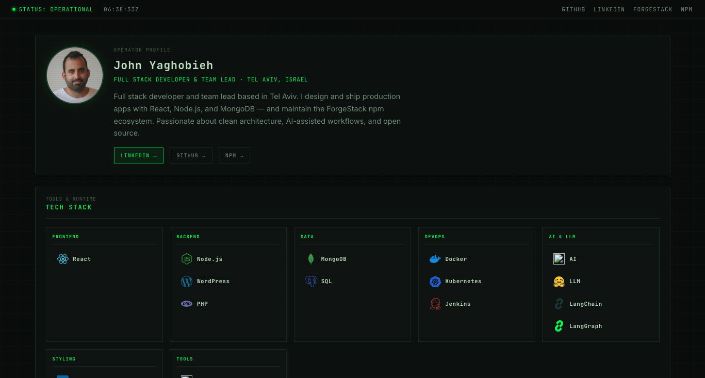

# John Yaghobieh

**Full Stack Developer & Team Lead · Tel Aviv, Israel**

> GitHub profile pages show this README only.  
> **The full interactive dashboard** (same as local `npm run dev`) lives on GitHub Pages ↓

---

### 🌐 Live dashboard

**[https://yaghobieh.github.io/yaghobieh/](https://yaghobieh.github.io/yaghobieh/)**

Profile · Tech stack · Package monitor · Intel feed — React + Vite, deployed from this repo.

<strong>First-time Pages setup (one click)</strong>

If the link above shows “Site not found”:

1. Open [github.com/yaghobieh/yaghobieh/settings/pages](https://github.com/yaghobieh/yaghobieh/settings/pages)
2. **Build and deployment → Source:** select **GitHub Actions**
3. Re-run the latest [Deploy workflow](https://github.com/yaghobieh/yaghobieh/actions/workflows/deploy.yml)

---

**STATUS: OPERATIONAL** · ForgeStack Intelligence · Built with React + Vite
